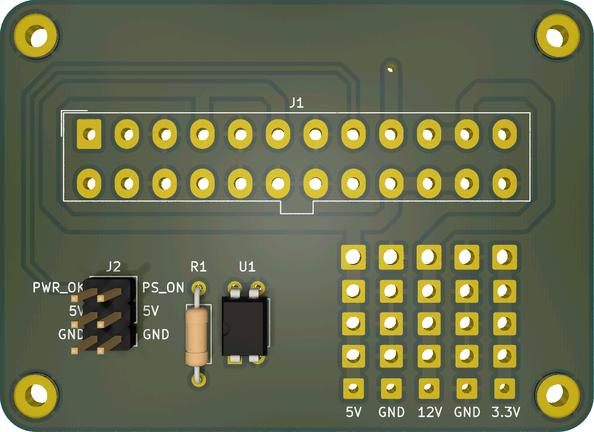

# ATX PSU Adapter

This simple breakout board for a 24-pin ATX power supply provides 12V, 5V, 3.3V, and standby 5V. Additionally, it also has a small circuit to control the PSU.

Personally, I'm using this PCB to power my Raspberry Pi via the standby 5V line and can automatically turn the PSU on or off for other devices that also draw power from the PSU.

